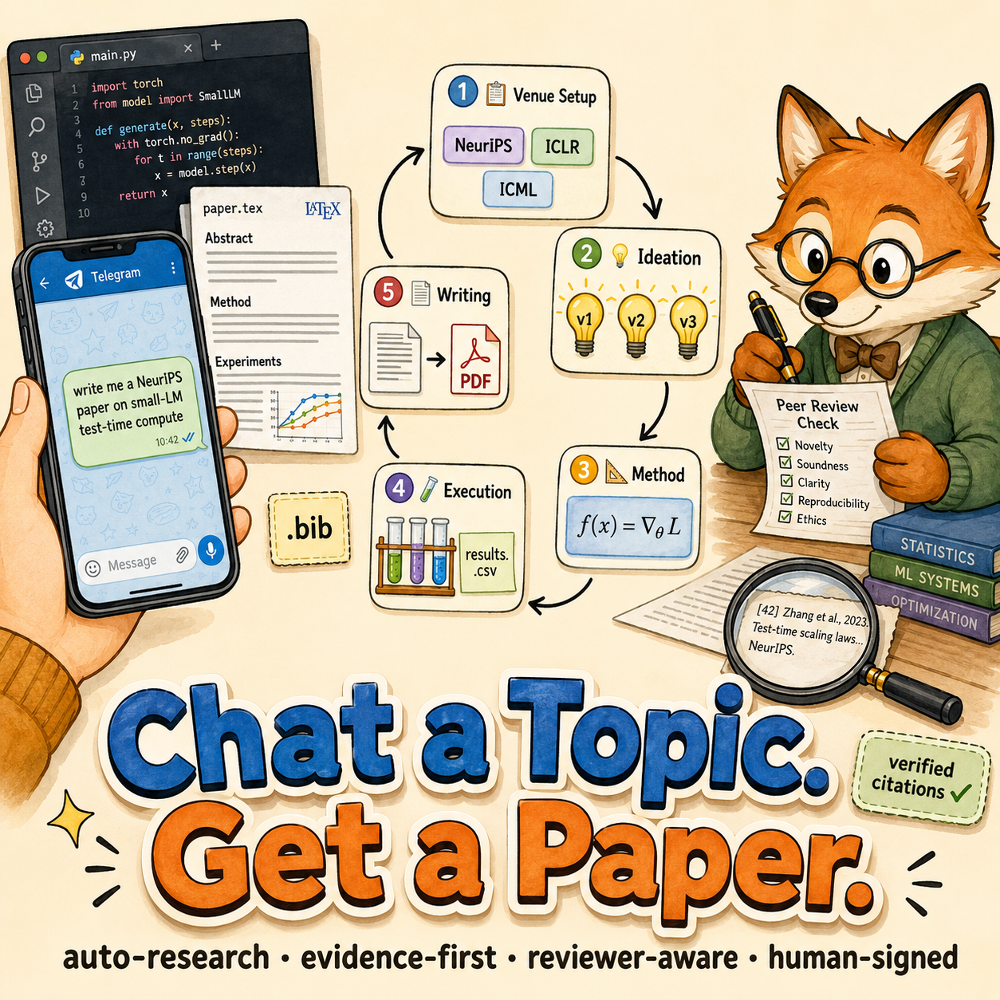

```mermaid
flowchart LR
    U(["👤 You"]) -->|"<b>write me a paper on X</b><br/>+ venue, budget, deadline"| O{{"🎯 Orchestrator<br/>contracts + integrity gate"}}
    O --> S0["📋 Stage 0<br/>Venue Setup<br/><i>fetch CFP +<br/>official LaTeX template</i>"]
    S0 --> S1["💡 Stage 1<br/>Ideation<br/><i>3 scored candidates<br/>STORM-style debate</i>"]
    S1 --> S2["📐 Stage 2<br/>Method<br/><i>equations + pseudocode<br/>+ experiment plan</i>"]
    S2 --> S3["🧪 Stage 3<br/>Execution<br/><i>train + log<br/>results.csv + report</i>"]
    S3 --> S4["📄 Stage 4<br/>Writing<br/><i>paper.tex + paper.pdf<br/>+ reviewer self-review</i>"]
    S4 -->|"hand_off.md"| H(["👤 You sign + submit"])
    classDef hot fill:#FFEDD5,stroke:#EA580C,color:#7C2D12,stroke-width:2px;
    classDef cold fill:#DBEAFE,stroke:#2563EB,color:#1E3A8A,stroke-width:2px;
    class O,S0,S1,S2,S3,S4 hot
    class U,H cold
```

<div align="center">

# 📝 auto-research

### Chat a Topic. Get a Paper.<br/>Evidence-First · Reviewer-Aware · Human-Signed.

*Just tell Claude Code or Codex:* **`write me a NeurIPS paper on X`**
*→ 5-stage pipeline → reviewer-style self-review → you sign your name.*



[](LICENSE)
[](#)
[](#)
[](https://claude.ai/code)
[](#)
[](auto-research/SKILL.md)
[](#)

</div>



<div align="center"><sub><i>Every stage hands off through <code>runs/&lt;run_id&gt;/stageN_*/hand_off.md</code>. Run a single stage, or restart from any stage.</i></sub></div>

---

`auto-research` is a staged "research topic → paper draft" CS/AI skill suite for Claude Code and Codex agents.

The core idea is to split a top-tier AI paper workflow into 5 stages, each owned by its own skill, with stages handing off through files under `runs/<run_id>/`. This avoids the usual failure modes: a crash forcing a restart from scratch, fabricated citations in the final paper, baselines silently downgraded mid-experiment.

---

## TL;DR

> You say "write me a NeurIPS paper on X." It first fetches the venue's official template and CFP, then runs: pick an idea → formalize the method → run experiments → draft LaTeX, and pauses for your sign-off at every stage transition.

It is **not** an auto-submit system, and it is **not** a paper-laundering tool. The final PDF is still a draft you must review, sign your name to, and take responsibility for.

---

## Beginner's Notice (Read Before First Use)

If you have never used an agent-style tool before, work through this checklist first — otherwise you will hit confusing errors fast.

### Who this skill is for

- You already have a rough research direction or question, and you want a collaborator that can mine literature, run baselines, organize results, and produce a LaTeX draft.
- You are targeting NeurIPS / ICLR / ICML / CVPR / ACL / EMNLP or similar top-tier CS/AI venues.
- You are happy to stay human-in-the-loop, making the call on idea selection, method, experiments, and revisions.

### Who this skill is **not** for

- You have no direction and expect the agent to "come up with a thesis topic for me" — it returns scored candidates, but research taste is still on you.
- You want a pure literature survey, a pure benchmark paper, or an engineering report — this pipeline defaults to a real research contribution.
- You expect it to bypass plagiarism checks, fabricate data, or auto-submit — this pipeline is **deliberately** built not to do those things.

### If you just joined a research group (the most important step — do this before anything else)

No amount of tooling makes up for missing research taste. Before you touch this skill, do the following:

1. **Sit down with your advisor and lock the direction.** Pin down: which sub-area you'll work in this year (or this semester), the concrete problem you're trying to solve, and what counts as an acceptable outcome (top-tier first-author paper? workshop? technical report?). Do not invent a direction yourself just because a skill name sounds cool.
2. **Ask your advisor or senior labmates for 2–3 recent SOTA papers** in that direction (NeurIPS / ICLR / ICML / CVPR / ACL tier, ideally from the last 1–2 years). Read them front to back. The goal is **not** to memorize the numbers — it is to learn:
   - what role each of **abstract / introduction / method / experiments / related work** plays, and how they are laid out;
   - which **baselines** were chosen and why;
   - what each **ablation** is actually proving;
   - what the paper's "selling point" is, why this venue accepted it, and what a reviewer probably attacked.
3. Once you can answer in 3–5 sentences: "what are the 3 strongest methods in this area solving, what are each one's weaknesses, and is there a gap none of them covers well?" — *then* start using this skill. If you can't, keep reading.

This step matters more than any software / environment prep below. Skip it, and you won't be able to judge the candidate ideas the pipeline produces, you won't be able to defend them in front of your advisor, and you'll waste compute (and goodwill) running the wrong one.

### Things to set up before you start

1. **Install Claude Code or the Codex CLI**, and confirm you can hold a normal conversation in the terminal. If `claude` / `codex` does not even launch cleanly, fix that before touching this skill.
2. **API key and billing** — a full pipeline run is not cheap; make sure your account has headroom.
3. **A clean working directory** (e.g. `~/research/`). All `runs/<run_id>/` artifacts live inside it. Don't run this from a Desktop full of unrelated files.
4. **A working LaTeX toolchain** — install TeX Live or MacTeX, and confirm `pdflatex hello.tex` works. Stage 4 needs it to produce a PDF.
5. **A Python environment, and ideally a GPU** — Stage 3 actually runs training/eval code. CPU-only is possible, but then your compute budget must be tiny up front or the run will burn tokens idling.
6. **A working vocabulary of a few terms**:
   - **CFP** (Call for Papers): the venue's submission notice — page limits, formatting, review focus. The pipeline auto-fetches it.
   - **Baseline**: prior methods you compare against. Missing baselines = guaranteed reject.
   - **Ablation**: experiments proving each proposed component pulls weight.
   - **run\_id**: identifier for one end-to-end run; the pipeline organizes all artifacts under it.

   You don't need to be an expert — each stage's `references/` expands on these — but you should at least not be lost when they appear.
7. **Skim the [Design Principles](#design-principles)**, especially `Evidence first` and `Human accountability`. Those two rule out "have the agent invent something that looks impressive."

### Recommended first-time path

- **Do not run the full pipeline cold.** First just run `auto-research-ideation`, look at the 3 scored candidate ideas, and get a feel for the interaction.
- Once that feels reasonable, run an end-to-end pass with a **small target** (a small dataset + a method that finishes in an hour or two) to validate the full file hand-off chain.
- Only then scale the compute budget up to something that resembles a real submission.

---

## What Each of the Five Skills Does

| Skill | Role | Input | Main outputs |
|---|---|---|---|
| `auto-research` | Orchestrator (does no research, only routing) | direction + target venue + budget + deadline | Creates `runs/<run_id>/`, calls the four skills below in order, enforces hand-off integrity |
| `auto-research-ideation` | Literature mining + idea generation | direction + venue CFP | 3 scored candidate ideas with real citations, 1 selected |
| `auto-research-method` | Method formalization + experiment design | selected idea | `method.md` (notation, equations, pseudocode) + `experiment_plan.yaml` (datasets, baselines, metrics, ablations, seeds) |
| `auto-research-execution` | Actually runs experiments | experiment plan | training/eval code, `results.csv`, `results_summary.json`, `run_report.md` |
| `auto-research-writing` | LaTeX paper drafting | everything above | `paper.tex` / `paper.pdf` / `references.bib` / `figures/`, plus reviewer-style self-review `review.md` |

`auto-research` itself **does not write code, mine literature, or write papers.** It sequences the four specialist skills and enforces integrity at each hand-off (no fabricated citations, no silent baseline downgrades, no tables without source data).

---

## Artifact Layout

```
runs/<run_id>/
├── run.yaml                        # direction, venue, budget, deadline, mode
├── stage0_setup/                   # target venue's LaTeX template + CFP
├── stage1_ideation/
│   ├── candidates.json             # 3 scored candidate ideas
│   └── chosen.json                 # the selected one
├── stage2_method/
│   ├── method.md                   # equations + pseudocode
│   └── experiment_plan.yaml        # datasets / baselines / metrics / ablations / seeds
├── stage3_execution/
│   ├── code/                       # actual experiment repo
│   ├── logs/
│   ├── results.csv
│   └── run_report.md
└── stage4_writing/
    ├── paper.tex
    ├── paper.pdf
    ├── references.bib
    ├── figures/
    └── review.md                   # reviewer-style self-review
```

---

## Design Principles

- **Evidence first** — every number and table cell in the paper must trace back to a row under `runs/<run_id>/results/`; the writing stage refuses to render a table cell with no source row.
- **Stage contracts** — stages communicate only via files; no "remembering the previous step in your head."
- **Venue-first setup** — the target venue is chosen before ideation, and the CFP + official template constrain the contribution.
- **Output-first writing** — start from results, limitations, and reviewability; style comes later.
- **Reviewer realism** — experiments and writing are organized around what a top-tier reviewer will attack.
- **Budget honesty** — compute, baselines, and failure criteria are locked before execution starts.
- **Human accountability** — generated papers are drafts; you must review and sign your name.
- **No evaluation-paper drift** — the pipeline will not silently collapse into a pure benchmark or model-comparison paper unless you explicitly ask.
- **External figure handoff** — for conceptual figures, the writing stage leaves LaTeX placeholders plus prompts ready to hand to Gemini / GPT-image.
- **Venue-aware writing budget** — strictly respects venue page limits, and when space allows defaults to a 1 – 1.5 page citation-rich Related Work section.

---

## Installation

### Claude Code

Claude Code auto-discovers skills under either:

- `~/.claude/skills/` (user scope, available in every project)
- `<project>/.claude/skills/` (project scope, current repo only)

Copy or symlink the five folders there:

```bash
# User scope
mkdir -p ~/.claude/skills
cp -r auto-research auto-research-ideation auto-research-method \
      auto-research-execution auto-research-writing ~/.claude/skills/

# Or project scope
mkdir -p .claude/skills
cp -r auto-research auto-research-ideation auto-research-method \
      auto-research-execution auto-research-writing .claude/skills/
```

Restart Claude Code afterwards (or run `/skills` to confirm all five appear). Any of these phrases will surface the orchestrator:

- "write me a paper on X"
- "auto research X"
- "做一篇关于 X 的论文"
- "想投 NeurIPS / ICLR / ICML / CVPR / ACL 的 X"

You can also jump to a specific stage by name, e.g. "run auto-research-writing, input is in `runs/2026-05-12-xxx/`".

### Codex / OpenAI-compatible agents

Drop the same five folders into your Codex skills directory; `agents/openai.yaml` provides the UI metadata.

---

## Quick Start (end-to-end example)

```text
You: targeting NeurIPS 2026, topic is test-time compute for small LMs,
     GPUs are 4×A100, deadline in 3 months. Run the full pipeline,
     pause for my approval before every hand-off.

Agent:
  → Stage 0: fetch NeurIPS 2026 CFP + LaTeX template into
              runs/2026-05-12-ttc-slm/stage0_setup/
  → Stage 1: mine literature, return 3 scored candidate ideas → wait for selection
  → Stage 2: write method.md + experiment_plan.yaml → wait for sign-off
  → Stage 3: execute the plan, emit results.csv + run_report.md
  → Stage 4: draft paper.tex, build paper.pdf, attach reviewer-style review.md
```

To continue from a specific stage: call the corresponding stage skill directly and point it at the previous stage's `hand_off.md`.

---

## Repository Layout

```text
auto-research/
auto-research-ideation/
auto-research-method/
auto-research-execution/
auto-research-writing/
docs/                # hero image (cosmetic)
README.md  README.zh-CN.md
```

Inside each skill folder:

- `SKILL.md` — trigger conditions + workflow
- `references/` — load-on-demand guidance (CFP parsing, state contract, integrity rules, …)
- `assets/` — templates, scripts, LaTeX scaffolds
- `agents/openai.yaml` — Codex-side UI metadata; Claude ignores it without error

---

## Compatibility

- The portable core is `SKILL.md` + `references/` + `assets/`, usable by both Claude-style and Codex-style skill systems.
- `SKILL.md` frontmatter is Claude Code's native format (`name` + `description`); every description stays within the 1024-character limit.
- `agents/openai.yaml` is Codex/OpenAI-compatible UI metadata only; Claude Code silently ignores it.
- The workflow is model-agnostic. The only hard assumptions are staged file hand-offs, tool access, and human checkpoints.

---

## Notes

- This is a CS/AI research workflow, not a general academic writing tool — social science / humanities / clinical work should not use it as-is.
- Failed experiments are supported as honest negative-result framing; the pipeline will **not** auto-launder them into positive conclusions.
- `auto-research-writing` defaults to a NeurIPS-style LaTeX template, with ICLR and ICML variants included.
- The default target is a real research contribution, not "evaluate many models on many benchmarks."
- For pipeline / method / concept figures, the writing stage leaves LaTeX placeholders plus prompt files you can hand to an external image model.
- This is research-assistance infrastructure, **not an auto-submit system** — the final submission is always a human decision.

---

<div align="center"><sub>
中文版 → <a href="README.zh-CN.md">README.zh-CN.md</a> · Code under MIT · 2026
</sub></div>
